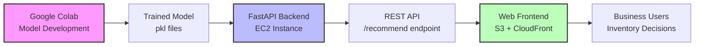

# Smart Inventory Advisor

> **ML-powered, risk-aware inventory decision system combining demand forecasting with uncertainty modeling**

[](https://www.python.org/downloads/)
[](https://fastapi.tiangolo.com/)
[](https://opensource.org/licenses/MIT)

A production-ready, full-stack application that improves stock availability while controlling inventory costs through machine learning-driven demand forecasting and uncertainty-aware decision making.

---

## 📊 Project Overview

**Smart Inventory Advisor** is an ML-powered, risk-aware inventory decision system that combines demand forecasting with uncertainty modeling to improve stock availability while controlling inventory cost. Unlike traditional point-forecast systems, this solution explicitly models demand uncertainty and translates ML predictions into actionable business decisions.

The system analyzes historical sales patterns, promotional activities, seasonal trends, and demand volatility to provide real-time inventory recommendations through an intuitive web interface backed by a FastAPI ML service.

---

## 🎯 Key Outcomes & Business Impact

This system delivers measurable improvements over naive ordering strategies:

| Metric | Result | Impact |
|--------|--------|--------|
| **Stock-out Reduction** | **~63%** | Significantly improved product availability |
| **Overall Inventory Cost** | **~43% reduction** | Lower total cost of inventory management |
| **Forecast Accuracy** | MAE ≈ 0.56, RMSE ≈ 0.85 | Reliable demand predictions |
| **Safety Stock Trade-off** | Higher holding cost | Offset by lower stock-out penalties |

> **Key Insight**: The primary value comes from **better decisions under uncertainty**, not just point forecast accuracy. By modeling the P90 uncertainty bounds and incorporating risk tolerance, the system makes safer decisions during demand spikes and volatile periods.

### Business Value Proposition

- **Reduced Lost Sales**: 63% fewer stock-outs means more revenue capture
- **Optimized Working Capital**: 43% cost reduction frees up cash flow
- **Risk-Aware Planning**: Adjustable risk tolerance for different business scenarios
- **Explainable Decisions**: Human-readable recommendations build trust with business users

---

## 🧠 Modeling Approach

The system employs a **three-stage decision pipeline**:

### 1. Demand Forecasting (P50)
- A machine learning regression model trained on historical sales data produces **median (P50) demand forecasts**
- Features include lagged demand, rolling statistics, seasonality indicators, and promotional events
- Model: Gradient Boosting / Random Forest regression optimized for MAE

### 2. Uncertainty Estimation (P90)
- Forecast uncertainty is estimated using **residual-based P90 bounds**
- The 90th percentile of historical forecast errors provides a conservative upper bound
- This captures demand volatility and model prediction uncertainty

### 3. Risk-Aware Inventory Policy
- Inventory decisions are made using a **risk-adjusted policy**:
  ```
  Recommended Order = P50 + α × (P90 - P50)
  ```
  where `α` (risk_alpha) is user-defined risk tolerance (0.0 = conservative, 1.0 = aggressive)

### Why This Matters

**Uncertainty modeling enables safer decisions** during:
- Demand spikes (promotions, festivals)
- Volatile periods (high rolling standard deviation)
- New product launches (limited historical data)

By explicitly modeling the P90 bound, the system avoids under-ordering during high-uncertainty scenarios, reducing costly stock-outs.

---

## 🔧 Feature Engineering & Insights

The model uses **13 engineered features** across four categories:

### Demand History Features
- `lag_1`, `lag_7`, `lag_14`: Recent sales patterns
- `rolling_mean_7`: Short-term demand trend
- `rolling_std_14`: Demand volatility indicator
- `rolling_median_7`: Robust central tendency measure

### Seasonality Features
- `day_of_week` (0=Monday, 6=Sunday): Weekly patterns
- `week_of_year` (1-52): Annual seasonality
- `month` (1-12): Monthly trends

### Event Indicators
- `promo`: Promotional campaign flag
- `festival`: Holiday/festival flag
- `discount_pct`: Discount percentage (0-100)

### Feature Importance Insights

Analysis of feature importance reveals:

1. **Recent Demand Volatility** (`rolling_std_14`): Strongest predictor
   - High variability signals uncertain demand → larger safety buffers needed
   
2. **Seasonality** (`day_of_week`, `month`): Strong seasonal patterns
   - Weekend vs. weekday effects
   - Holiday season spikes
   
3. **Promotional Effects** (`promo`, `discount_pct`): Moderate impact
   - Short-lived demand boosts
   - Requires careful post-promotion inventory management

4. **Lag Features** (`lag_1`, `lag_7`): Baseline demand indicators
   - Recent sales inform near-term expectations

> **Actionable Insight**: Demand volatility is the key driver of uncertainty. During high-volatility periods, the system automatically increases safety stock recommendations.

---

## 💡 Explainability

The system generates **human-readable explanations** for every recommendation using rule-based logic:

```python
"The recommendation considers that recent sales are higher than usual, 
demand uncertainty is elevated, a promotion is currently active, 
a higher risk tolerance was selected."
```

### Explanation Components

1. **Sales Trend**: Compares recent sales (`lag_1`) to 7-day average
2. **Uncertainty Level**: Evaluates P90-P50 spread relative to forecast
3. **Active Events**: Notes promotions, festivals, high discounts
4. **Risk Posture**: Reflects user's risk tolerance setting

This makes recommendations **interpretable for business users** who may not understand ML internals but need to trust the system's decisions.

---

## 🏗️ End-to-End System Architecture



### Development & Deployment Pipeline

1. **Model Development** (Google Colab)
   - Data preprocessing and feature engineering
   - Model training and hyperparameter tuning
   - Evaluation on hold-out test set
   - Model serialization (`.pkl` files)

2. **Backend Service** (FastAPI on AWS EC2)
   - Loads trained model artifacts at startup
   - Exposes `/recommend` REST API endpoint
   - Validates input features via Pydantic schemas
   - Returns business-friendly JSON responses

3. **Frontend Application** (Static hosting on S3 + CloudFront)
   - Modern SaaS-style web interface
   - Real-time API integration
   - Risk visualization and decision cards
   - Responsive design for mobile/desktop

4. **Production Deployment**
   - Backend: AWS EC2 instance with Uvicorn ASGI server
   - Frontend: S3 bucket with CloudFront CDN for global distribution
   - CORS configured for secure cross-origin requests

---

## 🛠️ Technology Stack

### Machine Learning & Data Science
- **Python 3.8+**: Core programming language
- **Pandas**: Data manipulation and feature engineering
- **NumPy**: Numerical computations
- **Scikit-learn**: ML model training (Gradient Boosting/Random Forest)
- **Joblib**: Model serialization and persistence

### Backend Service
- **FastAPI**: Modern, high-performance Python web framework
- **Pydantic**: Data validation and schema enforcement
- **Uvicorn**: ASGI server for production deployment

### Frontend Application
- **HTML5**: Semantic markup
- **CSS3**: Modern SaaS styling with glassmorphism effects
- **Vanilla JavaScript**: API integration and dynamic UI
- **Express.js**: Static file server for local development

### Development & Experimentation
- **Google Colab**: Interactive model development environment
- **Jupyter Notebooks**: Exploratory data analysis

### Cloud Infrastructure (Production)
- **AWS EC2**: Backend API hosting
- **AWS S3**: Frontend static file storage
- **AWS CloudFront**: CDN for global content delivery

---

## 🚀 Quick Start

### Prerequisites
- Python 3.8+
- Node.js 14+
- npm or yarn

### Backend Setup

1. **Navigate to API directory**
   ```bash
   cd api_call
   ```

2. **Install Python dependencies**
   ```bash
   pip install -r requirements.txt
   ```

3. **Start the FastAPI server**
   ```bash
   uvicorn app:app --reload --port 8000
   ```

   The API will be available at `http://localhost:8000`
   
   View interactive API docs at `http://localhost:8000/docs`

### Frontend Setup

1. **Navigate to website directory**
   ```bash
   cd website
   ```

2. **Install Node dependencies**
   ```bash
   npm install
   ```

3. **Start the Express server**
   ```bash
   npm start
   ```

   The frontend will be available at `http://localhost:3000`

---

## 📊 API Usage

### Endpoint
```
POST /recommend
```

### Request Schema

```json
{
  "lag_1": 0,              // Yesterday's sales
  "lag_7": 1,              // Sales 7 days ago
  "lag_14": 1,             // Sales 14 days ago
  "rolling_mean_7": 0.6,   // 7-day average sales
  "rolling_std_14": 1.2,   // 14-day sales variability
  "rolling_median_7": 1,   // 7-day median sales
  "promo": 1,              // Promotion flag (0 or 1)
  "festival": 0,           // Festival flag (0 or 1)
  "discount_pct": 20,      // Discount percentage (0-100)
  "day_of_week": 3,        // Day of week (0=Mon, 6=Sun)
  "week_of_year": 35,      // Week number (1-52)
  "month": 8,              // Month (1-12)
  "risk_alpha": 0.8        // Risk tolerance (0.0-1.0)
}
```

### Response Schema

```json
{
  "action": "ORDER",
  "quantity": 1,
  "risk_level": "High",
  "confidence_band": "0–1 units",
  "reason": "The recommendation considers that recent sales are lower than average, demand uncertainty is elevated, a promotion is currently active, a higher risk tolerance was selected."
}
```

### Example cURL Request

```bash
curl -X POST http://localhost:8000/recommend \
  -H "Content-Type: application/json" \
  -d '{
    "lag_1": 0,
    "lag_7": 1,
    "lag_14": 1,
    "rolling_mean_7": 0.6,
    "rolling_std_14": 1.2,
    "rolling_median_7": 1,
    "promo": 1,
    "festival": 0,
    "discount_pct": 20,
    "day_of_week": 3,
    "week_of_year": 35,
    "month": 8,
    "risk_alpha": 0.8
  }'
```

---

## 🎯 Why This Project Is Different

Most ML projects stop at model training. **This project goes further** by:

### 1. Explicitly Modeling Uncertainty
- Not just point forecasts—includes P90 uncertainty bounds
- Enables risk-aware decision making
- Handles volatile demand scenarios gracefully

### 2. Translating ML Outputs into Operational Decisions
- Converts forecasts into actionable ORDER/NO_ORDER recommendations
- Incorporates business constraints (risk tolerance, cost trade-offs)
- Provides human-readable explanations for every decision

### 3. Demonstrating Real Deployment & System Design
- Full-stack implementation (not just notebooks)
- Production-ready FastAPI backend
- Modern web frontend with real-time API integration
- Cloud deployment architecture (AWS EC2, S3, CloudFront)

### 4. Business-Focused Evaluation
- Measures success by **business outcomes** (stock-out reduction, cost savings)
- Not just ML metrics (MAE, RMSE)
- Demonstrates ROI for non-technical stakeholders

---

## 📁 Project Structure

```
inventory_management/
├── README.md                    # This file
├── .gitignore                   # Git exclusion rules
│
├── api_call/                    # FastAPI Backend
│   ├── app.py                   # Main API server
│   ├── requirements.txt         # Python dependencies
│   └── artifacts/               # ML model files
│       ├── demand_forecast_model.pkl
│       ├── feature_list.pkl
│       ├── model_metadata.pkl
│       └── residual_q90.pkl
│
└── website/                     # Frontend Application
    ├── README.md                # Frontend-specific docs
    ├── index.html               # UI with ML feature form
    ├── app.js                   # API integration logic
    ├── styles.css               # Modern SaaS design
    ├── server.js                # Express server
    ├── package.json             # Node dependencies
    └── images/                  # UI assets
```

---

## 🧪 Testing

### Backend API Test
```bash
curl -X POST http://localhost:8000/recommend \
  -H "Content-Type: application/json" \
  -d '{
    "lag_1": 5,
    "lag_7": 4,
    "lag_14": 3,
    "rolling_mean_7": 4.2,
    "rolling_std_14": 1.5,
    "rolling_median_7": 4,
    "promo": 0,
    "festival": 1,
    "discount_pct": 0,
    "day_of_week": 5,
    "week_of_year": 52,
    "month": 12,
    "risk_alpha": 0.5
  }'
```

### Frontend Test
1. Open `http://localhost:3000`
2. Fill in the form with test values
3. Click "Get AI Recommendation"
4. Verify the decision card displays correctly with action, quantity, risk level, and explanation

---

## 🔧 Configuration

### API URL (Frontend)
Edit `website/app.js`:
```javascript
const API_URL = 'http://localhost:8000/recommend';
```

For production:
```javascript
const API_URL = 'https://your-api-domain.com/recommend';
```

### CORS Settings (Backend)
Edit `api_call/app.py`:
```python
app.add_middleware(
    CORSMiddleware,
    allow_origins=["http://localhost:3000"],  # Your frontend URL
    allow_methods=["*"],
    allow_headers=["*"],
)
```

---

## 🚨 Troubleshooting

### CORS Errors
- Ensure FastAPI CORS middleware is configured
- Verify `allow_origins` includes your frontend URL
- Check API URL in `app.js` is correct

### Connection Refused
- Verify FastAPI backend is running on port 8000
- Check firewall settings
- Ensure correct API URL and port

### Invalid Response
- Verify response schema matches expected format
- Check browser console for detailed errors
- Ensure all required fields are present in response

---

## 📈 Future Enhancements

- **Multi-product Support**: Extend to handle multiple SKUs simultaneously
- **Automated Retraining**: Periodic model updates with new sales data
- **Advanced Forecasting**: Incorporate external factors (weather, competitor pricing)
- **Inventory Optimization**: Multi-echelon supply chain optimization
- **A/B Testing Framework**: Compare recommendation strategies in production

---

## 📝 License

MIT License - feel free to use this project for demos, portfolios, or production.

---

## 🤝 Contributing

Contributions are welcome! Please feel free to submit a Pull Request.

---

## 👨‍💻 For Recruiters & Hiring Managers

This project demonstrates:

✅ **End-to-end ML system design** (data → model → API → UI)  
✅ **Production deployment** (not just notebooks)  
✅ **Business impact focus** (63% stock-out reduction, 43% cost savings)  
✅ **Uncertainty modeling** (P90 bounds, risk-aware decisions)  
✅ **Full-stack development** (Python, FastAPI, JavaScript, AWS)  
✅ **Explainable AI** (human-readable recommendations)  
✅ **Modern tech stack** (FastAPI, Scikit-learn, Cloud deployment)

**Key Differentiator**: This project bridges the gap between ML research and operational business value.

---

**Built with ❤️ for intelligent inventory management**
